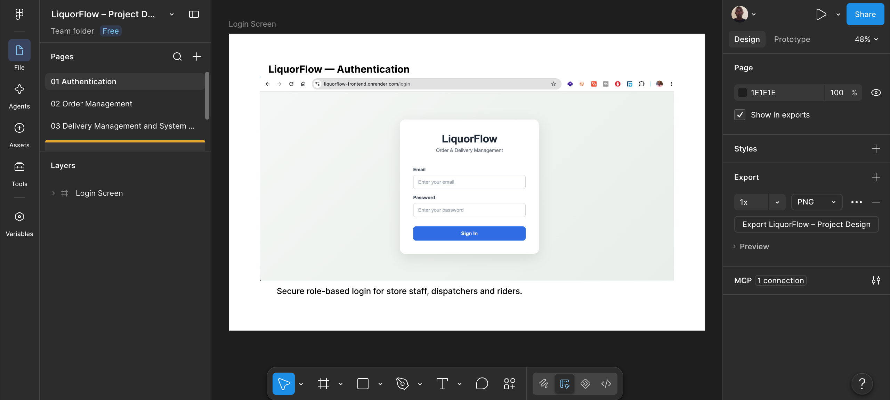
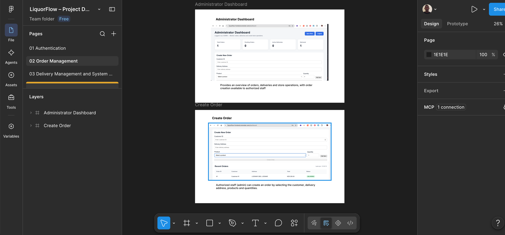
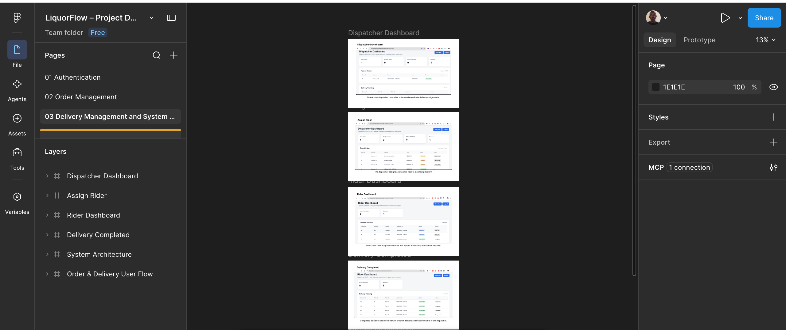
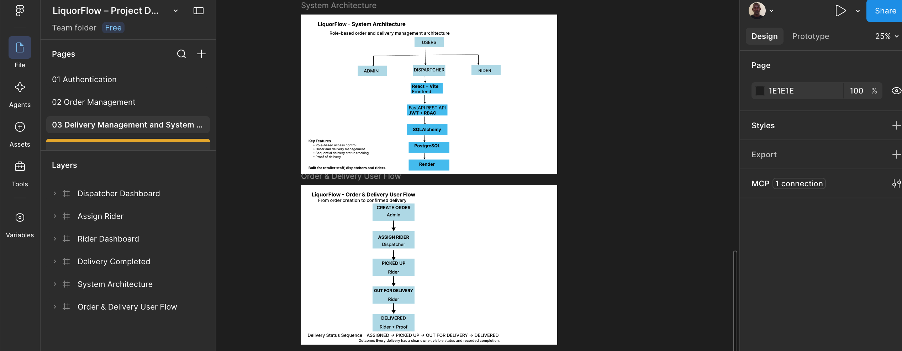

# LiquorFlow Screenshots

Project screenshots documenting the LiquorFlow interface, system architecture, and user flows.

## Screenshots

### Authentication

Secure role-based login interface for store staff, dispatchers, and riders.

### Order Management

Administrator order-management interface for creating and viewing customer orders.

### Delivery Management

Dispatcher and rider interfaces showing rider assignment and delivery-status workflow.

### Architecture & User Flow

Overview of the application architecture and the order-to-delivery workflow.

## Files

- `authentication.png` — Authentication interface
- `order-management.png` — Order management interface
- `delivery-management.png` — Delivery and rider workflow
- `architecture-and-user-flow.png` — System architecture and order/delivery user flow
